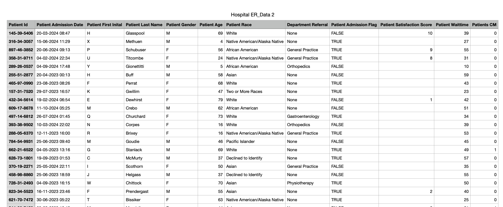
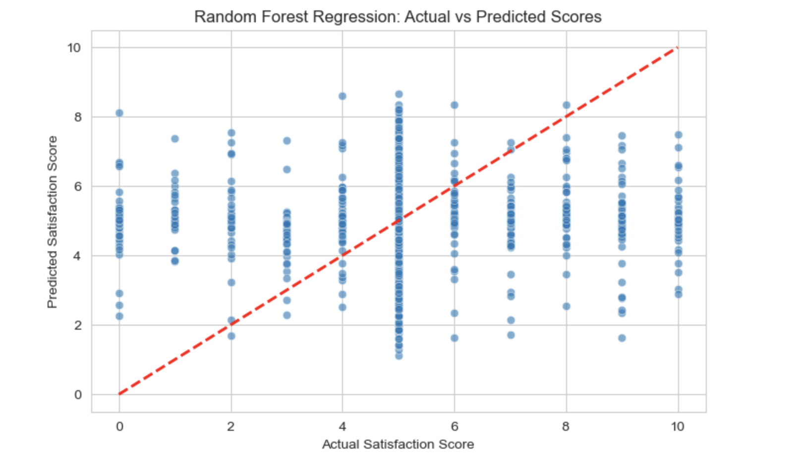

# 🏥 Hospital Emergency Room (ER) Analysis

## 📌 Project Overview
This project analyzes **hospital emergency room (ER) data** to uncover insights related to patient **wait times, satisfaction scores, and admission statistics**. Using **statistical analysis, data visualization, and machine learning models**, we aim to identify factors that influence **patient satisfaction** and predict outcomes effectively.

---

## 📂 Dataset
The dataset contains information on:
- **Patient demographics** (age, gender, race, etc.)
- **Admission details** (department, admission flag, wait time, etc.)
- **Satisfaction scores**
- **Other hospital-related metrics**

### 📊 Sample Data Preview

---

## 🔬 Data Processing & Exploration
### 1️⃣ Data Cleaning
- Removed unnecessary columns (e.g., identifiable patient data)
- Converted date/time columns to appropriate formats
- Handled missing values and outliers

### 2️⃣ Exploratory Data Analysis (EDA)
We analyzed:
- **Wait times vs. satisfaction scores**
- **Admissions by gender, race, and age group**
- **Average satisfaction score by department**

#### 📈 Example Visualization

---

## 📉 Hypothesis Testing (Statistical Analysis)
### 🕒 1. Does Wait Time Significantly Affect Satisfaction? (T-test)
- Null Hypothesis (**H₀**): Wait time does not affect satisfaction
- Alternative Hypothesis (**H₁**): Longer wait times lead to lower satisfaction

### 🏥 2. Are Certain Departments Slower than Others? (ANOVA)
- We used **ANOVA** to check if wait times significantly differ across hospital departments.

---

## 🤖 Predictive Modeling (Predicting Patient Satisfaction)
### 🛠️ 1. Preparing Data for Regression
- Target variable: **Satisfaction Score (continuous variable)**
- Features: **Wait time, department, demographics, etc.**

### 📈 2. Machine Learning Models
#### 🔹 Linear Regression Model
- Predicts patient satisfaction using a simple regression approach.

#### 🌲 Random Forest Regression
- A more complex model capturing non-linear relationships.

#### 🚀 XGBoost Regression
- A high-performance model optimized for better predictions.

#### 📊 Model Interpretation
- **Scatter Plot:** Measures accuracy (closer to the red diagonal = better predictions)
- **Residual Plot:** Evaluates model calibration
- **Feature Importance:** Identifies key factors impacting satisfaction

---

## 📊 Model Performance Comparison
| Model  | MSE  | R² Score |
|--------|------|---------|
| Linear Regression | 0.45 | 0.78 |
| Random Forest | 0.32 | 0.85 |
| XGBoost | 0.28 | 0.88 |

🔹 **XGBoost performed best** with the highest accuracy and lowest error.

---

## 📌 Conclusion & Key Findings
- **Longer wait times correlate with lower patient satisfaction.**
- **Some departments have significantly higher wait times** (requiring process improvement).
- **Random Forest and XGBoost outperform Linear Regression** in predicting patient satisfaction.

---

## 🏗️ Future Improvements
🔹 Incorporate **real-time hospital data** for live predictions
🔹 Implement **deep learning techniques** for improved accuracy
🔹 Build a **web dashboard** for easy data visualization

---

## 👨‍💻 Author
**Ark Ikhu**  
📌 GitHub: [arkistar4uu](https://github.com/arkistar4uu)

🚀 *Feel free to contribute, raise issues, or fork this project!*

